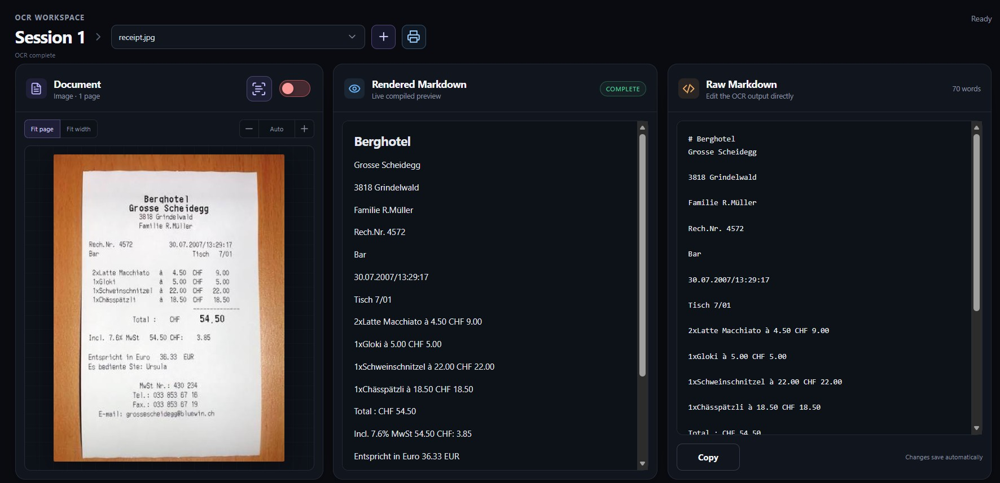

# DocsLaju — Mistral OCR Workspace

A Flask-based document OCR workspace powered by Mistral. Upload PDFs or images, compare the original page with rendered Markdown, and edit the raw OCR result in a focused three-pane interface.



## Flask draft

This branch transitions the UI from Streamlit to a custom Flask frontend while preserving the original workflow:

- **Left pane:** interactive PDF page or original image, file picker, and page navigation
- Native browser PDF viewer with the original document's text selection, zoom, and navigation
- **Middle pane:** safely rendered Markdown preview with tables and locally bundled KaTeX math
- **Right pane:** raw Markdown editor with autosave and clipboard copy
- Multiple independent OCR sessions
- Project folders with drag-and-drop organization
- Rename, pin, archive, move, and delete session actions
- Collapsible sidebar with the preference retained in the browser
- Header document picker with per-document deletion and an adjacent upload button
- Drag-and-drop PDF/image upload directly onto the preview pane
- Non-blocking automatic OCR toggle with progress and immediate queue cancellation
- SQLite persistence for sessions, uploads, and per-page OCR edits
- Per-page OCR and editing with `mistral-ocr-latest`
- Browser-native PDF export containing every rendered OCR page and extracted image
- Responsive mobile/tablet layout

The local draft runs as a seeded admin user without a login screen. Its sessions,
projects, uploaded files, active selection, and page-level OCR results persist in
`instance/docslaju.sqlite3`, so restarting Flask does not clear the workspace.

## Setup

Requires Python 3.10 or newer.

```powershell
python -m venv .venv
.venv\Scripts\Activate.ps1
pip install -r requirements.txt
Copy-Item .env.example .env
```

If `MISTRAL_API_KEY` is already configured in your system environment, no `.env` file is required. Otherwise, add your key to `.env`:

```dotenv
MISTRAL_API_KEY="your-key-here"
FLASK_SECRET_KEY="a-long-random-development-secret"
# DOCSLAJU_DB_PATH="instance/docslaju.sqlite3"  # optional
```

Start the development server:

```powershell
python app.py
```

If Python is not installed system-wide but `uv` is available:

```powershell
uv run --python 3.12 --with-requirements requirements.txt python app.py
```

Then open <http://127.0.0.1:5000>.

## Test

```powershell
python -m pytest -q
```

The route tests do not call Mistral. Live OCR requires a valid `MISTRAL_API_KEY`.

## Project layout

```text
app.py                         Flask application and JSON API
db/
├── README.md                  Database structure and ownership notes
└── schema.sql                 SQLite tables, constraints, indexes, and seed
instance/
└── docslaju.sqlite3           Runtime database (automatic; Git-ignored)
src/
├── mistral_client.py          Mistral SDK integration
└── services/database.py       SQLite repository
templates/index.html           Three-pane application shell
static/app.css                 Responsive visual design
static/app.js                  Sidebar, upload, OCR, editor, and export behavior
static/vendor/katex/           Local KaTeX renderer, fonts, and license
tests/                         Unit, persistence, and Flask route tests
```

The complete database repository tree and relationship diagram are in
[`db/README.md`](db/README.md). The executable schema is in
[`db/schema.sql`](db/schema.sql).

## Notes

- Supported inputs: PDF, PNG, JPG/JPEG, and WEBP (30 MB maximum in this draft).
- PDFs are loaded directly from Flask into the browser's built-in PDF viewer; the app does not rasterize PDF previews or synthesize a text layer.
- Only text selectable in the original PDF is selectable in the preview. Scanned/image-only PDFs and uploaded images remain non-selectable even after OCR.
- HTML typed into the Markdown editor is escaped before rendering.
- KaTeX is bundled in `static/vendor/katex`, so math rendering does not require a CDN or npm at runtime.
- OCR-extracted images are stored as document-owned SQLite BLOB assets. Editable
  Markdown uses short paths such as `assets/report-2-image-1.jpg`; the live
  preview resolves them through an ownership-checked Flask endpoint.
- The header export button opens an A4 print view for every source page, renders
  local KaTeX and stored image assets, and opens the browser print dialog. Choose
  **Save as PDF** for a single document-wide PDF; no server browser runtime is required.
- The existing `.md` and `.zip` export endpoints remain available for portable
  Markdown workflows.
- Deleting a project moves its sessions to **Unfiled**. Deleting a session also
  deletes its stored documents and OCR pages.
- The automatic-OCR worker processes its queue outside the Flask request, allowing
  page navigation and the rest of the UI to remain responsive. Switching the
  toggle off cancels queued pages immediately; if Mistral is already processing a
  page, its returned result is discarded.
- Triggering current-page OCR while automatic OCR is active promotes that page to
  the front of the persistent queue. A page already sent to Mistral finishes first,
  then the promoted page runs next.
- SQLite page claims prevent manual and batch requests from processing the same
  document page concurrently.
- Deleting a document cascades to all of its extracted asset rows.
- The existing OpenAI dependency is retained for future restoration of AI-generated filenames, but it is not used by this Flask draft.

## License

MIT License
